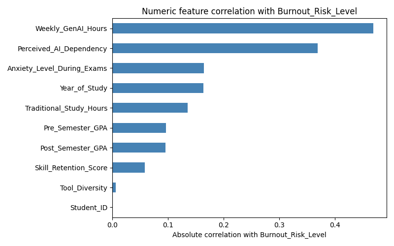

# Student AI Dependency Prediction


## Dataset

Source: https://www.kaggle.com/datasets/laveshjadon/ai-impact-on-students

License: CC0: Public Domain — free to use, modify, and redistribute without restriction or attribution.

This dataset has student survey records with demographic, study, and AI usage information.

## Project Goal

This project prepares the dataset for predictive modeling and trains a logistic regression model to predict simplified levels of perceived AI dependency.

## Files

- `features.py` - loads raw data, removes duplicates/nulls, maps `Year_of_Study`, and saves `preprocessed_data.csv`.
- `eda.py` - loads preprocessed data and prints correlation and categorical summaries against burnout risk.
- `train_model.py` - trains and evaluates logistic regression with encoded/scaled features.
- `tests/test_pipeline.py` - automated tests for preprocessing, target mapping validation, and training flow.

## Preprocessing Steps

1. Load `ai_student_impact_dataset.csv`.
2. Remove duplicate rows.
3. Remove rows with missing values.
4. Map `Year_of_Study` from text to ordinal numbers.
5. Save cleaned data to `preprocessed_data.csv`.

## Model Pipeline

Target (`Perceived_AI_Dependency`) is simplified into 3 classes:

- `Low` = 1, 2, 3
- `Medium` = 4, 5, 6, 7
- `High` = 8, 9, 10

Features used:

- `Year_of_Study`
- `Weekly_GenAI_Hours` (log transformed)
- `Traditional_Study_Hours`
- `Anxiety_Level_During_Exams`
- `Skill_Retention_Score`
- `Institutional_Policy` (one-hot encoded)

Other pipeline details:

- Train/test split with stratification
- Numeric scaling with `MinMaxScaler`
- Logistic regression with `max_iter=1000`
- Validation check to fail fast if target has unmapped values

## Exploratory Data Analysis

`eda.py` also saves a bar chart of numeric feature correlations with `Burnout_Risk_Level`:



## Model Performance

Latest run on the provided dataset:

- Baseline accuracy (majority class): `0.5331`
- Logistic regression accuracy: `0.6821`

The model performs above baseline, and the 3-class target is more stable than the original 10-level target.

## Key Findings

- **Weekly time spent using GenAI tools is the strongest signal for burnout.** Students who use AI tools more hours per week tend to report higher burnout risk more than any other factor measured.
- **Self-reported AI dependency is the second strongest signal.** Students who say they rely more heavily on AI also tend to report more burnout.
- **Exam anxiety and year of study matter, but less.** These have a moderate relationship with burnout, but nowhere near as strong as AI usage hours or dependency.
- **Traditional study habits, GPA, and skill retention are only weakly related to burnout on their own.**
- **The model correctly predicts a student's AI dependency level (Low / Medium / High) about 68% of the time**, compared to 53% if you just guessed the most common category every time. That's a meaningful improvement, not a huge one — useful as a starting signal, not a definitive diagnosis.

## Reproducibility

Requires Python 3.10 or newer (minimum supported by `numpy==2.2.6` and `scikit-learn==1.7.2`).

From the project directory:

```bash
pip install -r requirements.txt
py features.py
py eda.py
py train_model.py
```

Run tests:

```bash
py -m unittest discover -s tests -p "test_*.py"
```

## Test Coverage

Automated tests currently verify:

1. Preprocessing output is created and year mapping is applied.
2. Invalid target values raise a clear error.
3. Training pipeline fits and returns valid metrics.

## Continuous Integration

`.github/workflows/tests.yml` runs the test suite automatically on every push and pull request to `main`, using GitHub Actions (GitHub's hosted CI service). It provisions a clean Ubuntu VM, installs `requirements.txt`, then runs the same `unittest discover` command shown above. This catches regressions before they reach `main` without requiring anyone to remember to test manually.

## Limitations

- Current cleaning drops all rows with null values.
- Evaluation is based on one train/test split.
- Logistic regression is used as a strong baseline, not a final model search.

## Next Improvements

- Add cross-validation.
- Add model artifact saving and a simple inference script.
- Add schema checks for real dataset columns.

## License

This project is licensed under the [MIT License](LICENSE).
